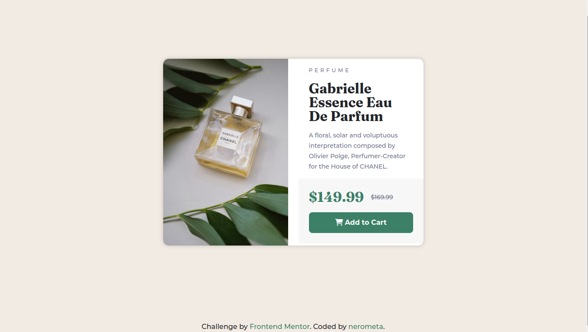

# Frontend Mentor - Product preview card component solution

This is a solution to the [Product preview card component challenge on Frontend Mentor](https://www.frontendmentor.io/challenges/product-preview-card-component-GO7UmttRfa). Frontend Mentor challenges help you improve your coding skills by building realistic projects.

## Table of contents

- [Overview](#overview)
  - [The challenge](#the-challenge)
  - [Screenshot](#screenshot)
  - [Links](#links)
- [My process](#my-process)
  - [Built with](#built-with)
  - [What I learned](#what-i-learned)
  - [Useful resources](#useful-resources)
- [Author](#author)
- [Acknowledgments](#acknowledgments)

**Note: Delete this note and update the table of contents based on what sections you keep.**

## Overview

### The challenge

Users should be able to:

- View the optimal layout depending on their device's screen size
- See hover and focus states for interactive elements

### Screenshot



### Links

- [Solution URL](https://your-solution-url.com)
- [Live Site URL](https://nerometa.github.io/product-preview-card-component-challenge/)

## My process

So I started out by setting up partial .scss files to store variables and CSS reset code snippets, then imported it to the main .scss file. Then I code the product preview section as a Bootstrap card. The product image is pretty hard to work with, but I will show you how I got the solution.

### Built with

- HTML5
- Bootstrap
- SCSS

### What I learned

I learned how to make a card image display to the left or right of content. Bootstrap only got top and bottom card image class, so this is the workaround:

```html
<div class="product-card card mb-3" role="">
  <div class="row no-gutters flex-column flex-md-row">
    <div class="product-img col">...</div>
    <div class="product-content col">...</div>
  </div>
</div>
```

Basically, you have to divide columns inside a card. One column has image, another has content. Wrap them in row class, then use `flex-column` and `flex-row` to achieved the design. Since you need to display image to the side of the content when you got bigger screen, `flex-md-row` is used to apply `flex-direction: row` _after_ screen width past or equal `md` breakpoint (768px).

### Useful resources

- [Bootstrap Card](https://stackoverflow.com/questions/39225608/bootstrap-flexbox-card-move-image-to-left-right-side-on-desktop) - This was the solution to card image I found on StackOverflow.

## Author

- Website - [nerometa](https://www.github.com/nerometa)
- Frontend Mentor - [@nerometa](https://www.frontendmentor.io/profile/nerometa)
